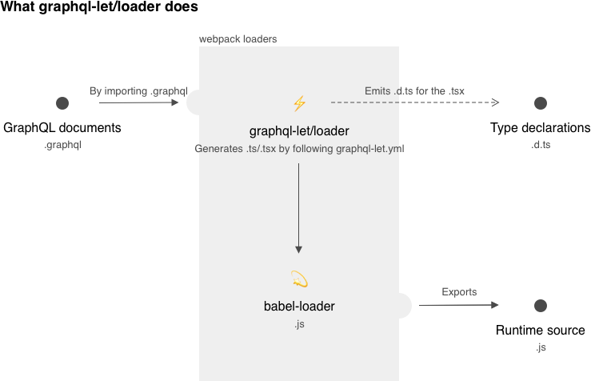
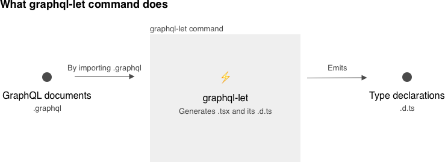

# graphql-let [](https://github.com/piglovesyou/graphql-let/actions) [](https://badge.fury.io/js/graphql-let)

A webpack loader to import type-protected codegen results directly from GraphQL
documents.

Try
[the Next.js example](https://github.com/zeit/next.js/blob/canary/examples/with-typescript-graphql/README.md#readme)
that integrates graphql-let.

## Why it exists

One of the strengths of GraphQL is
[enforcing data types on runtime](https://graphql.github.io/graphql-spec/June2018/#sec-Value-Completion).
Further, TypeScript and
[GraphQL Code Generator](https://graphql-code-generator.com/) (graphql-codegen)
make it safer by typing data statically, so you can write truly type-protected
code with rich IDE assists.

To enhance the development pattern, it's necessary to focus on a more specific
use-case than what graphql-codegen allows; binding TypeScript (and assuming the
use of Apollo-Client and React). In the way, graphql-let behaves as a subset of
graphql-codegen.

graphql-let lets you import graphql-codegen results directly per GraphQL
documents with TypeScript type definitions by webpack Loader power.

```typescript jsx
import { useNewsQuery } from './news.graphql'

const News: React.FC = () => {
	// Typed already️⚡️
	const { data: { news } } = useNewsQuery()
	if (news) return <div>{news.map(...)}</div>
}
```

## How it works

Two things:

-   It runs graphql-codegen inside according to the `.graphql-let.yml` and pass
    the generated TypeScript source to the next loader.
-   It generates a file `.d.ts`.

<p align="center"></p>

You may also want only `.d.ts` before a webpack build to check types. Run
`graphql-let` command to get `.d.ts` without running webpack.

<p align="center"></p>

## Get started

This is an example of **TypeScript + React + Apollo Client**. Please replace the
corresponding lines depending on your needs.

### 1. Install dependencies

Note graphql-let is `devDependencies`.

```
npm install -D graphql-let @graphql-codegen/cli @graphql-codegen/plugin-helpers @graphql-codegen/typescript @graphql-codegen/typescript-operations @graphql-codegen/typescript-react-apollo
npm install @apollo/react-common @apollo/react-components @apollo/react-hooks
```

### 2. Configure

#### .graphql-let.yml

Run this command to have a configuration template.

```
npx graphql-let init
# This will generate .graphql-let.yml
```

Next add
[graphql-codegen plugins](https://graphql-code-generator.com/docs/plugins/index)
in it. **Please note that you have to generate TypeScript source** by the
plugins.

Edit it like this:

```diff
 schema: lib/type-defs.graphqls
 documents: '**/*.graphql'
 plugins:
   - typescript
+  - typescript-operations
+  - typescript-react-apollo
```

Available options:

| property           | required | type                                    | meaning                                                                                                                                        | examples                                                                                                                                                                                                                                                                                                                                                               |
| ------------------ | :------: | --------------------------------------- | ---------------------------------------------------------------------------------------------------------------------------------------------- | ---------------------------------------------------------------------------------------------------------------------------------------------------------------------------------------------------------------------------------------------------------------------------------------------------------------------------------------------------------------------- |
| `schema`           |    ✔︎    | `string \| { [url: string]: any }`      | The GraphQL schema info that graphql-let requests introspection to.                                                                            | <ul><li>`http://localhost:3000/graphql`</li><li>`schema.json`</li><li>`schema.graphqls` (Note: glob is not supported)</li><li>`{"https://api.github.com/graphql": {"headers": {"Authorization": "YOUR-TOKEN"}}}` (Please do the left in yaml)</li></ul>[All available formats](https://graphql-code-generator.com/docs/getting-started/schema-field#available-formats) |
| `documents`        |    ✔︎    | `string \| string[]`                    | The GraphQL documents info of quereis and mutations etc. All the documents have to be separate files.                                          | `./queries-and-mutations/**/*.graphql`                                                                                                                                                                                                                                                                                                                                 |
| `plugins`          |    ✔︎    | `string[] \| { [name: string]: any }[]` | The plugins of graphql-codegen.                                                                                                                | <ul><li>`typescript-operations`</li><li>`typescript-react-apollo`</li><li>`add: "/* eslint-disable */"`</li></ul>[All available plugins](https://graphql-code-generator.com/docs/plugins/)                                                                                                                                                                             |
| `respectGitIgnore` |    ✔︎    | `boolean`                               | Whether to use `.gitignore` to ignore like `node_modules`. It's passed to [globby](https://www.npmjs.com/package/globby#gitignore) internally. | `true`                                                                                                                                                                                                                                                                                                                                                                 |
| `config`           |          | `Record<string, boolean \| string>`     | The configuration for the plugins. [more info](https://graphql-code-generator.com/docs/getting-started/config-field)                           | These are configured by default. <ul><li>`withHOC: false`</li><li>`withHooks: true`</li></ul>                                                                                                                                                                                                                                                                          |
| `cacheDir`         |          | `string`                                | Custom cache directory. It's `node_modules/graphql-let/__generated__` by default, which you can overwrite by this option.                      | `__generated__`                                                                                                                                                                                                                                                                                                                                                        |
| `TSConfigFile`     |          | `string`                                | Custom path to a TypeScript configuraiton. It's `tsconfig.json` by default, which you can overwrite by this option.                            | `tsconfig.custom.json`                                                                                                                                                                                                                                                                                                                                                 |

#### .gitignore

graphql-let will generate `.d.ts` files in the same folder of `.graphql`. Add
these lines in your .gitignore.

```diff
+*.graphql.d.ts
+*.graphqls.d.ts
```

#### webpack.config.ts

The webpack loader also needs to be configured. Note that the content that
`graphql-let/loader` generates is JSX-TypeScript. You have to compile it to
JavaScript with an additional loader such as `babel-loader`.

```diff
 const config: Configuration = {
   module: {
     rules: [
+      {
+        test: /\.graphql$/,
+        use: [
+          { loader: 'babel-loader', options: { presets: ['@babel/preset-typescript', '@babel/preset-react'] } },
+          { loader: 'graphql-let/loader' },
+        ]
+      }
     ]
   }
 }
```

### 3. Generate type declarations

Run this to generate `.d.ts`.

```
npx graphql-let

# This will generate files such as:
#   - src/query.graphql.d.ts
#   - src/schema.graphqls.d.ts
```

By `--config` option you can specify the custom path to the `.graphql-let.yml`.
The directory .graphql-let.yml is located at is the basepath of the relative
paths in .grpahql-let.yml. Also, the basepath should be identical to **webpack's
`config.context`** so the loader can find the config file.

```
pwd # "/app"
npx graphql-let --config custom/path/.graphql-let.yml

# This will point paths such as:
# /app/custom/path/src/query.graphql.d.ts
# /app/custom/path/src/schema.graphqls.d.ts
```

You may want to run it everytime calling `tsc`. Please check your `package.json`
and modify like this.

```diff
   "scripts": {
-     "build": "tsc"
+     "build": "graphql-let && tsc"
   },
```

### 4. Code more

Enjoy HMR (Hot Module Replacement) of webpack with the generated react-apollo
hooks and IDE code assists.

```typescript jsx
import { useNewsQuery } from './news.graphql'

const News: React.FC = () => {
    // Already typed⚡️
    const { data: { news } } = useNewsQuery()
    if (news) return <div>{ news.map(...) }</div>
}
```

## Experimental feature: Resolver Types

If:

-   your `schema` in .graphql-let.yml points to a single local GraphQL schema
    file (`.graphqls`)
-   you have installed
    [`@graphql-codegen/typescript-resolvers`](https://graphql-code-generator.com/docs/plugins/typescript-resolvers)
    in dependencies

, graphql-let will generate `.graphqls.d.ts` to help you type your GraphQL
resolvers. Run:

```bash
yarn add -D @graphql-codegen/typescript-resolvers

yarn graphql-let
```

then you will get `Resolver` type from the schema file.

```typescript
import { Resolvers } from "./type-defs.graphqls";

const resolvers: Resolvers = {
  Query: {
    // All typed⚡️
    viewer(parent, args, context, info) {
      return { ... }
    },
  }
};

export default resolvers;
```

`graphql-let/schema/loader` is also available. It just pass GraphQL Content to
the next loader but it updates resolver types in HMR. Set it up as below:

```diff
 const config: Configuration = {
   module: {
     rules: [
+      {
+        test: /\.graphqls$/,
+        use: [
+          { loader: 'graphql-tag/loader' },
+          { loader: 'graphql-let/schema/loader' },
+        ]
+      }
     ]
   }
 }
```

## Experimental feature: Babel Plugin for inline GraphQL documents

It lets you to convert a source as:

```typescript jsx
import gql from "graphql-let";

// Typed️⚡️
const { useViewerQuery } = gql(`
    query Viewer {
        viewer { name }
    }
`);
```

into the output as:

```typescript jsx
import * as V07138c from "../__generated__/input-07138c.tsx";
const { useViewerQuery } = V07138c;
```

with type declarations like:

```typescript
declare function useViewerQuery(...): ...;

default function gql(
    gql: `
    query Viewer {
        viewer { name }
    }
`
): { useViewerQuery: typeof useViewerQuery };
```

### Limitations

-   **Sadly**, type injection can't be done with TaggedTemplateExpression such
    as `` gql`query {}` ``. This is the limitation of TypeScript (from my
    current understanding.
    [Please answer me if you have ideas.](https://stackoverflow.com/questions/61917066/can-taggedtempalte-have-overload-signatures-with-a-certain-string-literal-argume))
-   Fragments are still not available. Please watch
    [the issue.](https://github.com/piglovesyou/graphql-let/issues/65)

### Configuration

Install these dependencies:

```
yarn add -D graphql-let slash do-sync @babel/core @babel/parser @babel/traverse @babel/helper-plugin-utils
```

with the plugin configuration in such as `babel.config.json`:

```json
{
    "plugins": ["graphql-let/babel"]
}
```

## FAQ

#### So, it's just a graphql-codegen wrapper generating `d.ts`...?

_Yes._

#### Is this a tool only for React?

No. There are
[more plugins that also generates `.ts` from GraphQL documents](https://graphql-code-generator.com/docs/plugins/).

#### Can I write GraphQL documents in my `.tsx` as `` const query = gql`query News{ ... }`; ``?

Afraid not. You need to have separate files to execute the webpack loader.
Besides, typing the value of `` gql`...` `` would be impossible.

#### What's the extension `.graphqls`? Should I use it for schema and `.graphql` for documents?

Not exactly, but I'd recommend them. I think using different extensions for
schema/documents leads to a more understandable configuration for webpack
loaders with fewer pitfalls. Another reason for `.graphqls` is that it's one of
[the supported extensions in the internal library](https://github.com/ardatan/graphql-toolkit/blob/d29e518a655c02e3e14377c8c7d3de61f08e6200/packages/loaders/graphql-file/src/index.ts#L9).

#### How to integrate Apollo refetchQueries?

[Query document exports `DocumentNode` named `${QueryName}Document` that you can make use of it.](https://github.com/piglovesyou/graphql-let/issues/66#issuecomment-596276493)

#### How to import `.graphql` from another, to import GraphQL Fragment for example?

You can't yet.
[Please watch the progress.](https://github.com/piglovesyou/graphql-let/issues/65)

## Contribution

-   **[Create an issue](https://github.com/piglovesyou/graphql-let/issues/new)**
    if you have ideas, found a bug or anything.
-   **Creating a PR** is always welcome!
    -   Please make sure that `yarn prepare` passes, including linting, build
        and tests.
    -   Adding test is preferrable. But don't hesitate without it, maybe someone
        else will fill it.

## License

MIT
